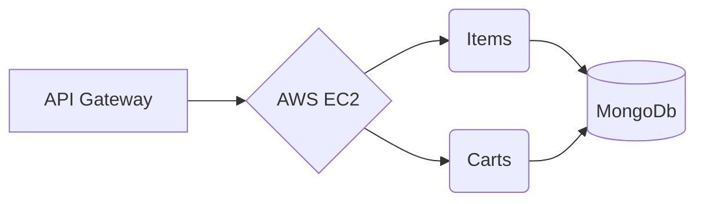

# Shopping Cart Design System

This document outlines the design system for a simple shopping cart with the following requirements:

1. API Gateway.
2. Rest API.
3. Non relational database.
4. AWS host.

